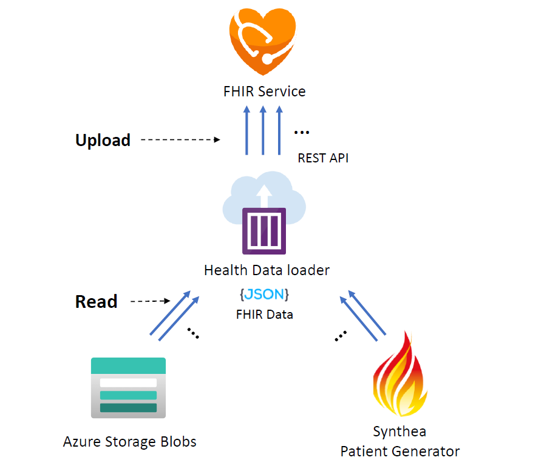
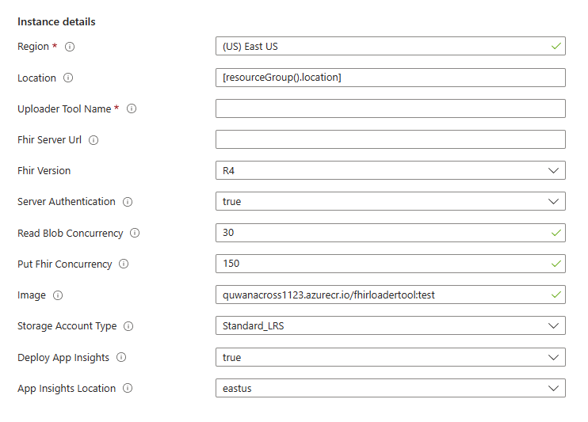

# Health Data Loader Tool

Health Data Loader Tool is a simple project to continuously upload healthcare data to services.

## FHIR Data Loader

FHIR Data Loader uses the RESTful API to **continuously**, **fast** upload FHIR resources to the FHIR service.

Support two kinds of data sources:
1. FHIR data as NDJson format on the Azure Storage Blobs.
2. FHIR data directly generated by internally integrated [Synthea Patient Generator](https://github.com/synthetichealth/synthea).

    

Using the **Managed Idenitiy** for authentication to the FHIR service or to the Azure Storage.

### Deploy the FHIR Data Loader tool

1. To deploy the FHIR Data Loader as an [Azure Container Instance](https://learn.microsoft.com/en-us/azure/container-instances/), use the button below to deploy with [ARM template](./deploy/DeployContainerInstance.json) through the Azure Portal.
   
    

    The deployment page should open the following form. 
    
    

2. Fill the form based on the table below and click on **Review and Create** to start the deployment.

    |Parameter   | Description   |
    |---|---|
    | Resource Group | Name of the resource group where you want the pipeline related resources to be created. |
    | Location | The location to deploy the FhirToDatalake pipeline. |
    | Uploader Tool Name | The name of the container instance that you wish to create. |
    | Fhir Server Url  | The URL of the FHIR server. If the baseUri has relative parts (like http://www.example.org/r4), then the relative part must be terminated with a slash, (like http://www.example.org/r4/). |
    | Server Authentication  |  Whether to access the FHIR server with managed identity authentication. Set it to false if you are using an instance of the FHIR server for Azure with public access. |
    | Fhir Version | Version of the FHIR server. Currently only R4 is supported. |
    | Blob List File | The blob list file, the Uploader Tool will read data from those blobs. |
    | Read Blob Concurrency | Count of concurrent jobs reading FHIR data blobs on the Azure Storage. |
    | Put Blob Concurrency | Count of concurrent jobs putting FHIR data to service.|
    | Image | Fhir Uploader Tool Container image to deploy. |
    | Storage Account type | Azure Storage Account type to deploy. |

### 2. Provide Access To The Container Instance

1. Provide Access of the FHIR server to the Azure Container Instance.

    If you are using the Azure API for FHIR or the FHIR service in Azure Healthcare APIs, assign the **FHIR Data Reader** role to the Azure Container Instance deployed above.

    If you are using the FHIR server for Azure with anonymous access, then you can skip this step.

2. Provide Access of the Azure Storage to the Azure Container Instance.
   
    Assign the **FHIR Data Reader** role to of the Storage to the Azure Container Instance deployed above.

    The Azure Container Instance will read blobs from **"Blob List File"**.

### 3. Restart the Container Instance

Restart the deployed Container Instance if it haved terminated because of access permission problems.

## DICOM Data Loader
Document TBD.